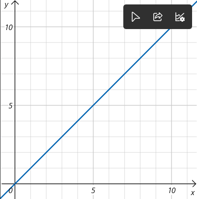
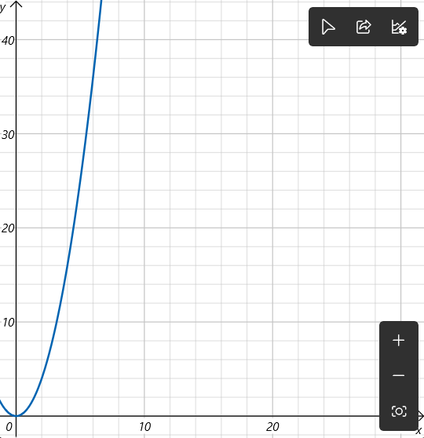
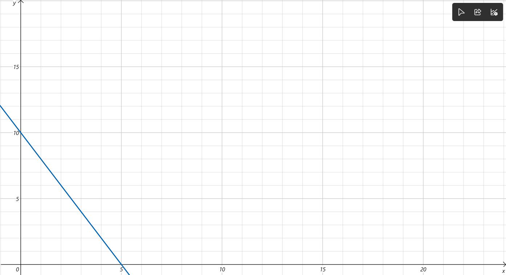
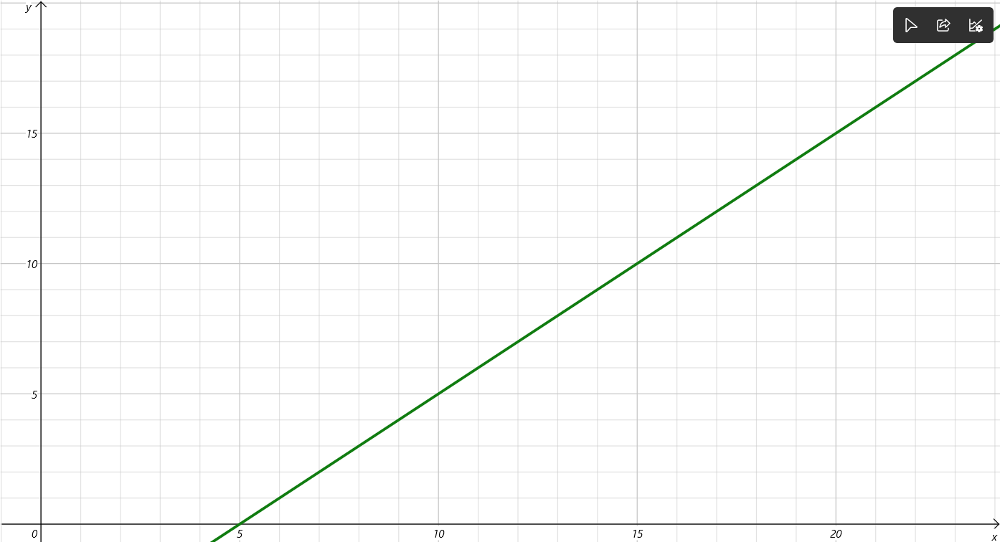
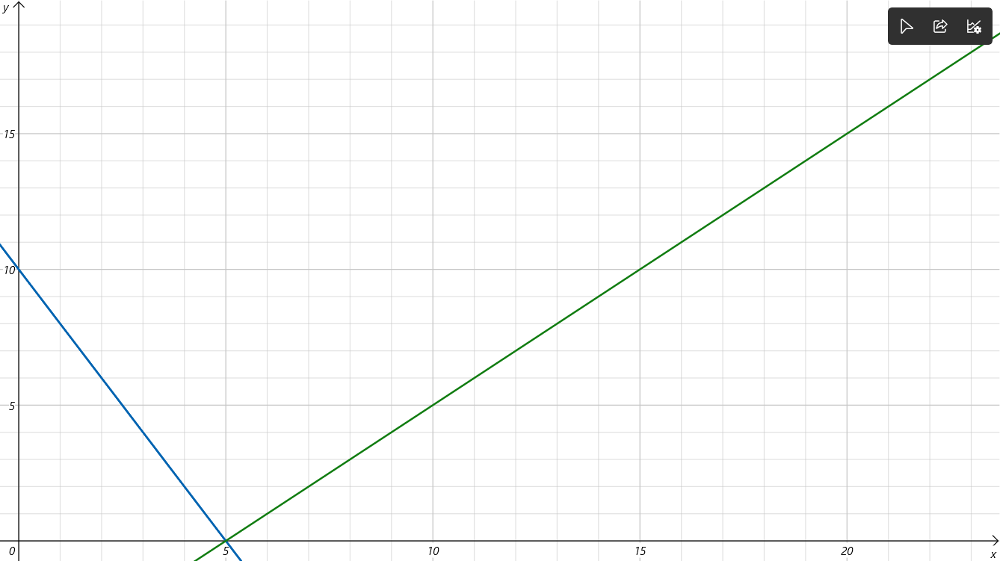

# What is Geometry?

Geometry is a math about shape? Yes, it is. It is called Euclidean Geometry, found by Euclid. Euclid is a very important to geometry. Withou Euclid, our geometry will absent for few hundred years.

## Basic unit

What is the basic unit of geometry? It does not easy to explain.

We often say that the dot is the basic unit of geometry. Because many dot without space will form a line, and two line which is cross each other will form a angle. Three line will form a basic shape -- triangle.

So, most important thing in geometry is dots, lines, angle and shape.

## Formula

We know how to calculate a square's area, perimeter and its volume.

The formula is:

Square/rectangle area = $$ length · width$$

Square/rectangle volume = $$ length · width · height$$

We know that triangle area is $$ \frac {1} {2} base · height$$

We know circle's area and its perimeter is $$ \pi r^2$$ and $$ 2\pi r$$ respectively.

If I want you to find what is the area of a square which has 16cm perimeter, can you solve it?

3,2,1:
$$(\frac {16cm} {4})^2$$

expand it will get:
$$ (4cm)^2 = 4cm · 4cm= 16cm^2$$

Congratulation! You had solve a basic geometry question.

## Geometry vs Algebra

This is a war in math.

You might think, how to connect a shape and a 𝑥. Good, we didn't know at past. But now, we have a category in math called Analytical geometry.

Do you know what is x-axis and y-axis? They cross to each other. This is like we talked. But, x and y is algebra letter!

Let y equals to x:

This ↗ line is the graph of y = x.

Seems geometry and algebra has some relationship ...

## Solve a algebra problem

Given two equation :
2𝑥+𝑦=10 and 𝑥=𝑦+5
Find the value of y.

### Algebra solution

$$ 2x+y=10,x=y+5$$
$$ 2(y+5)+y=10 $$
$$ 2y+10=10,2y=10-10=0$$

Thus,
$$y= \frac{0} {2} = 0$$
and :
$$ x=0+5=5$$

Or you can do like this:
$$ 2x+y+(x)=10+y+5 $$
$$ 2x+y+x=10+5+y $$
$$ 2x+x+y=15+y $$
$$ 3x+y=15+y $$
$$ 3x+y-y=15 $$
$$ 3x = 15 $$
$$ x = \frac {15} {3}=5 $$

### Geometry solution

Lets control the x's value.

#### 2x + y = 10

| x | y | 2x+y=10 |
| --- | --- | --- |
| 1 | 8 | 2 + 8 =10 |
| 2 | 6 | 4 + 6 = 10 |
| 3 | 4 | 6 + 4 = 10 |
| 4 | 2 | 8 + 2 = 10 |
| 5 | 0 | 10 + 0 = 10 |

Its graph is like this:

#### x = y + 5

Change to this:

y = -x + 5

Because:
$$ x - y = y + (-y) + 5 $$
$$ x - y = 5 $$
$$ x - x - y = 5 - x $$
$$ -y = 5 - x $$
$$ -y · -1 = （5 - x） · -1 $$
$$ y =  -5  + x = -x + 5$$

| x | y | y = -x + 5 |
| --- | --- | --- |
| 1 | 4 | 4 = (-1) + 5 |
| 2 | 3 | 3 = (-2) + 5 |
| 3 | 2 | 2 = (-3) + 5 |
| 4 | 1 | 1 = (-4) + 5 |
| 5 | 0 | 0 = (-5) + 5 |

### Result

If we put these together:

These two line cross at a dot called (5,0) in form of (x,y).

Thus,
The answer is x = 5 and y = 0.

## What just happened?

You might curious why. The picture that you see, called Coordinate geometry or Cartesian geometry.

Coordinates is the main character in f_2. Coordinates is sets of numbers used to determine the exact position of a point, line, or shape on a map, graph, or three-dimensional(3D) space.

This is textbook explain. Mainly, it is a position of point, which mean where are the dots. We use sets of number (,) to show the place.

We often use $$ (x,y) $$ at 2D Cartesian plane/Coordinate plane.

But, at sometimes we need to perform the dots on the unit circle, we need unit circle plane, and use $$ (cos\theta ,sin\theta)$$ to say the position.
