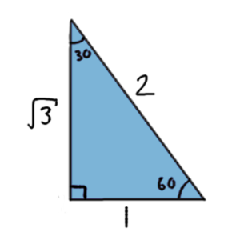
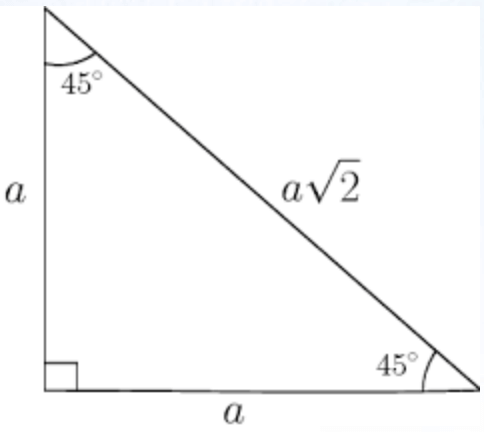
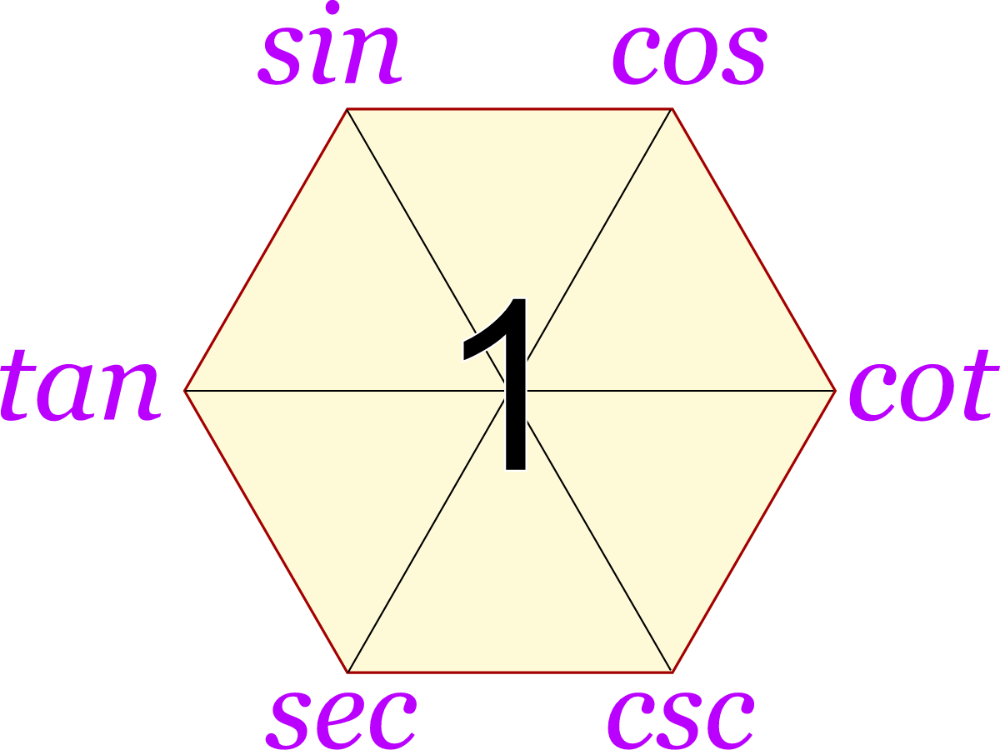

# What is trigonometry?

We just take a look for cos and sin at f_2, right? So what is that?

You may think these two is just a useless function, and a rubbish button at calculator, because it always below at ln and log.

But, it is a very important thing to connect algebra and geometry.

## Why?

A right angled triangle, have a 30°'s angle, and its length of hypotenuse is 14. What is its opposite?

We know Pythagorean theorem $ a^2 + b^2 = c^2 $
Equal to:
$$ a^2=c^2-b^2. a=\sqrt{(c^2-b^2)} $$
But now we don't know the value of b, do it don't have a solution? No.

## sin

$$ sinθ = \frac {opposite}{hypotenuse} $$

Now we know the value of c (hypotenuse) and θ (angle), we can find the value of a (opposite).

$$ sin30= \frac {opposite}{14} $$

Lets change a place.

$$ sin 30 · 14 =\frac{opposite}{14} ·14$$
$$ sin 30 · 14 = {opposite}$$
$$ opposite = \sin 30 · 14 $$
$$ opposite = \frac{1}{2} · 14 $$
$$ opposite = 7 $$

Tadaa! The value is appear.

Why we use sin not cos or other trigonometry? The reason is actually simple. Just because sin has our known (hypotenuse) and unknown value (opposite).

You can also use csc. But it is not that suitable because $ csc = (\sin x) ^ {-1}$. It is acceptable, but we won't use it because it is a hassle. But if you use, we won't stop you. Math is fair.

## New big boss

If you think Calculus is hard, then Trigonometry is easier, just a little bit. So we need to remember some specific value. Sorry about that.

| Name | Defination | 30° | 45° | 60° |
| --- | --- | --- | --- | --- |
| sin | $\frac{opposite}{hypotenuse}$ | $\frac{1}{2}$ | $\frac{1}{\sqrt{2}}$ | $\frac{\sqrt{3}}{2}$ |
| cos | $\frac{adjacent}{hypotenuse}$ | $\frac{\sqrt{3}}{2}$ | $\frac{1}{\sqrt{2}}$ | $\frac{1}{2}$ |
| tan | $\frac{opposite}{adjacent}$ | $\frac{1}{\sqrt{3}}$ | 1 | $\sqrt{3}$ |
| cot | $\frac{adjacent}{opposite}$ | $\sqrt{3}$ | 1 | $\frac{1}{\sqrt{3}}$ |
| csc | $\frac{hypotenuse}{opposite}$ | 2 | $\sqrt{2}$ | $\frac{2}{\sqrt{3}}$ |
| sec | $\frac{hypotenuse}{adjacent}$ | $\frac{2}{\sqrt{3}}$ | $\sqrt{2}$ | 2 |

Function below tan is not nessary to remember. But it is good to know. Oh, I spoke it out. Yes, Trigonometry is a function like f(x).

## How?

### 30°

You might think how we know the value of 30° 45° 60°. Lets take a look.

Do you know $\angle30°$ triangle has a special properties: Its opposite is a half of its hypotenuse. This image's opposite is 1, adjacent is $\sqrt{3}$, hypotenuse is 2. opposite and adjacent can reverse, below is different way.

For calculate easily ... OK, Actually is I am lazy （〃｀ 3′〃）. Let assume the length of oppsite is 1, then the hypotenuse will be 1·2 = 2. By using Pythagorean theorem, we can get the adjacent is $a = \sqrt{c^2-b^2} =\sqrt{2^2-1^2} =  \sqrt{3}$.

So, we can get the value of $\sin 30° = \frac{1}{2}$, $\cos 30° = \frac{\sqrt{3}}{2}$, $\tan 30° = \frac{1}{\sqrt{3}}$.

csc, sec and cot is the reciprocal of sin, cos and tan, respectively. So just reverse the value.

### 45°

Do you know $\angle45°$ triangle has a special properties: Its opposite and adjacent are equal. Let assume the length of oppsite is 1, then the hypotenuse will be 1·$\sqrt{2}$ = $\sqrt{2}$. By using Pythagorean theorem, we can get the adjacent is $\sqrt{2}$.

So, we can get the value of $\sin 45° = \frac{1}{\sqrt{2}}$, $\cos 45° = \frac{1}{\sqrt{2}}$, $\tan 45° = 1$.

Reverse the certain value to get csc, sec and cot.

### 60°

Do you know $\angle60°$ triangle has a special properties: Its opposite is 2 times of adjacent. Let assume the length of oppsite is 1, then the hypotenuse will be ... Ok, actually we can reuse the value of 30° triangle. Just let $\angle 30°$ become $\angle 60°$

So, we can get the value of $\sin 60° = \frac{\sqrt{3}}{2}$, $\cos 60° = \frac{1}{2}$, $\tan 60° = \sqrt{3}$.

Reverse the certain value to get csc, sec and cot.

## Conclusion

We can get the value of $\sin$, $\cos$ and $\tan$ by using the triangle. But like I said, trigonometry is not only about triangle, it is also about the unit circle.

## Special knowledge

Do you realize that sinx's value plus cosx's value is always 90°? Do you realize that tanx = sinx / cosx?

### 1. Reciprocal Identities

Across the center (diagonal lines):

| Identity |
| ---------- |
| $\sinθ = \frac{1}{\cscθ}$,  $\cscθ = \frac{1}{\sinθ}$ |
| $\cosθ = \frac{1}{\secθ}$,  $\secθ = \frac{1}{\cosθ}$ |
| $\tanθ = \frac{1}{\cotθ}$,  $\cotθ = \frac{1}{\tanθ}$ |

---

## 2. Quotient Identities

Going around clockwise:

| Identity |
| ---------- |
| $\tanθ = \frac{\sinθ}{\cosθ}$ |
| $\cotθ = \frac{\cosθ}{\sinθ}$ |
| $\secθ = \frac{1}{\cosθ}$ |
| $\cscθ = \frac{1}{\sinθ}$ |

Also:

- $\cotθ = \frac{\cosθ}{\sinθ}$

---

## 3. Product Identities

**Each function equals the product of its two neighbors.**

Examples:

- $$\sinθ = \tanθ ·\cosθ \$$
- $$\cosθ = \sinθ ·\cotθ \$$
- $$\tanθ = \sinθ ·\secθ \$$
- $$\cotθ = \cosθ ·\cscθ \$$
- $$\secθ = \tanθ ·\cscθ \$$
- $$\cscθ = \secθ ·\cotθ \$$

---
